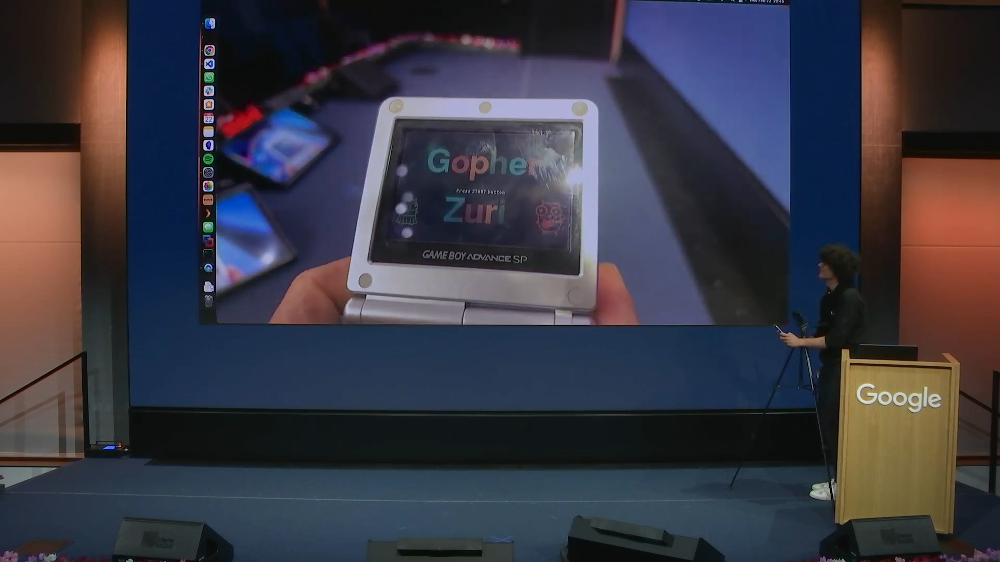
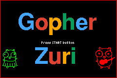
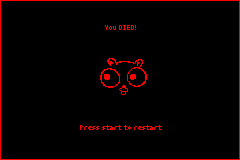

# Gopher Zuri



[Recording](https://www.youtube.com/watch?v=8QsvREVQ3Dc) and [slides](https://docs.google.com/presentation/d/1Ysgks0HLChBmqPH6e3A4Z_ixQlsNtVy4_WhBkVMtPHE/edit?usp=sharing)

Heavily based on [Learning Go by examples by Aurélie Vache](https://dev.to/aurelievache/learning-go-by-examples-part-5-create-a-game-boy-advance-gba-game-in-go-5944) article series on Dev.to.

Please check [Tinygo package compatibility](https://tinygo.org/docs/reference/lang-support/stdlib/#time) before importing different packages

## General

This simple app/game run on Game Boy Advance portable console and:
* display a screen with "Gopher" text and "Press START button"
* display two gophers
* When you press START button: your Gopher player just appear
* With multi directionnal arrows you can move your Gopher at left, right, top or bottom
* When you press A button: your Gopher jump :-D 
* When you press SELECT button, you go back to "Start" screen

## Pre-requisites

Install Go in 1.16 version minimum.

Brew:
```bash
brew install go-task
brew install tinygo
brew install mgba
```

## Run the app (during development)

```
task run
```


Note: `time` does not work: https://remyhax.xyz/posts/gba-blog/ https://github.com/tinygo-org/tinygo/issues/1578

## Build the app

`task build`

## Test the app/game

Let's run our app on mGBA emulator:

`task mgba`

### mGBA Controls

Controls are configurable in the **settings** menu of **mGBA**. Many game controllers should be automatically mapped by default. 
The default keyboard controls are as follows:

```
A: X
B: Z
L: A
R: S
Start: Enter
Select: Backspace
```

### My changes:

- I've refactored some of the functions
- Improved the speed of the Gopher movement by implementing the [redrawing the gopher](https://dev.to/aurelievache/learning-go-by-examples-part-5-create-a-game-boy-advance-gba-game-in-go-5944#comment-1i83i)
- Added a check if the gopher is within the display frame
- Added a Game Kill Screen :)
- Added a score that is calculated based on number of interrupts passed
- Added wind to generate random movement, I think now we can call it a game



>Note: sometimes the game randomly crashes :)

### M1 Mac support:
If you get the following error:
```bash
MacBook-Air tiny-gba % task build
task: [build] GOFLAGS=-mod=mod tinygo build -size short -o bin/gopher.gba -target=gameboy-advance .
/opt/homebrew/bin/tinygo: line 2: /opt/homebrew/Cellar/tinygo/0.27.0/libexec/tinygo: Bad CPU type in executable
/opt/homebrew/bin/tinygo: line 2: /opt/homebrew/Cellar/tinygo/0.27.0/libexec/tinygo: Undefined error: 0
task: Failed to run task "build": exit status 1
```

Do this:
```bash
softwareupdate --install-rosetta
GOFLAGS=-mod=mod arch -x86_64 tinygo build -size short -o bin/gopher.gba -target=gameboy-advance .
```

It seems that Mac OS will remember to run this binary in x86 mode. You can now use the regular `task build`, no need to modify the `Taskfile.yml`
